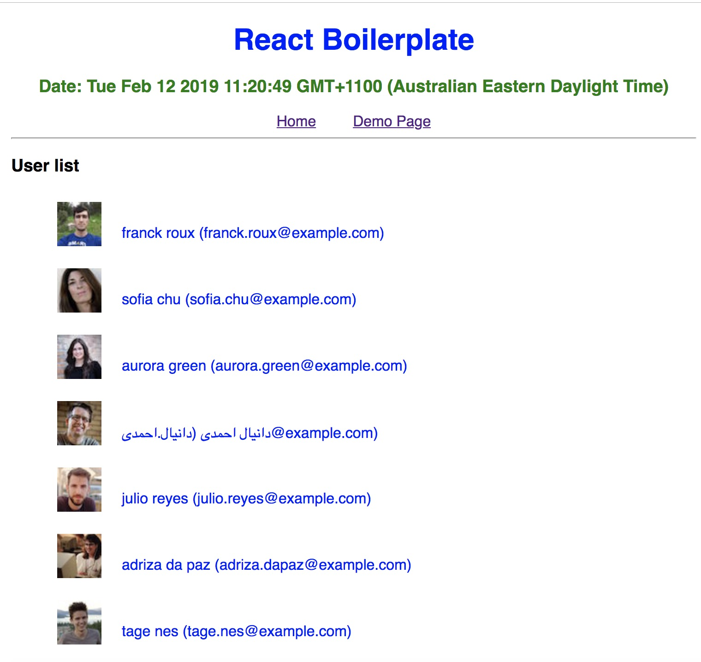

# React Boilerplate

## Overview
This repo serves as a boilerplate for react. A few main keys are:
- Redux
- Saga
- CSS Module
- Build and run in docker
- eslint
- PropTypes
- axios for api request
- Project structure
```
    src
        - actions
        - components
        - consts
        - containers
        - reducers
        - sagas
        - stores
        - utils
```

## Sample screen

